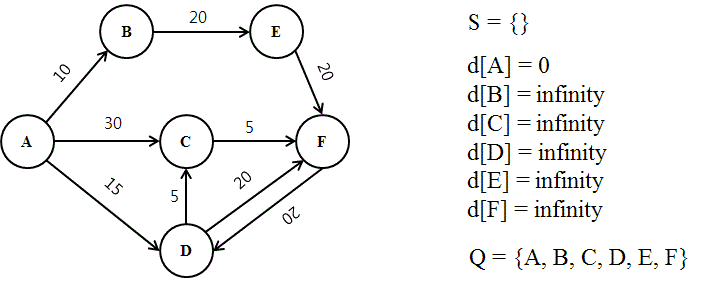
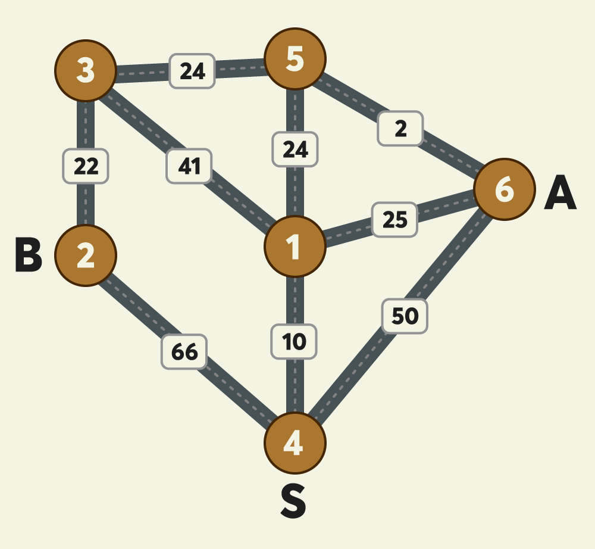

# 합승 택시

## 문제

- **Input**
  - `n` = 지점의 개수 (3 이상 200 이하)
  - `s` = 출발 지점
  - `a` = A의 도착 지점
  - `b` = B의 도착 지점
    - s, a, b는 1 이상 n 이하 자연수, 모두 다른 값
  - `fares` = 지점 사이의 예상 택시요금
    - 2차원 정수 배열
    - 크기 = 2 이상 n x (n-1) / 2 = nC2 (간선의 개수)
    - [c, d, f] = c지점과 d지점 사이의 예상 택시요금이 f원
      - c, d는 1 이상 n 이하의 자연수, 각각 서로 다른 값
      - f는 1 이상 100,000 이하인 자연수
      - 양방향 간선

- **Output**
  - A, B 두 사람이 s에서 출발해서 각 도착 지점까지 택시 탈 때 **최저 예상 택시요금**
  - 합승은 선택 사항
  - s에서 a와 b로 가는 경로가 항상 존재함이 보장됨

<br>
<br>

## Key Point

- 다익스트라 = 한 노드와 다른 모든 노드 간의 최소 거리를 구하는 알고리즘
- **합승하는 경우와 아닌 경우를 구분**
  - k번 노드까지 합승한다고 가정할 때: `dist_s[k] + dist_a[k] + dist_b[k]` 의 최솟값
- **MAX의 크기와 타입 설정이 매우 중요!**
  - 요금 최대 100,000 × 노드 최대 200 = 20,000,000 → MAX는 충분히 크게
  - 세 dist 값을 더할 때 int 오버플로우 주의 → `long long` 사용

<br>

### Dijkstra's Algorithm

- Greedy + 우선순위 Queue를 이용한 최단 경로 알고리즘
- 한 노드와 다른 모든 노드 간의 최단 거리를 구할 때 유용
- 매 순간마다 최단거리 노드를 선택(Greedy)하면서 인접 노드를 update!

<br>

- **Logic**
  
  1. 시작점을 제외하고 모두 dist를 INF로 초기화
  2. 매번 가장 가까운 노드부터 처리 (Greedy)
     1. 이미 확정된 노드면 skip
     2. 인접 노드 전부 update 시도 (이때, 더 짧은 경로에 대해서만)

<br>

- **구현 방법**
  다음 방문할 노드를 정할 때 현재 노드에서 갈 수 있는 최단거리를 선택!
  - 우선순위 큐 활용: `O((V+E) log V)`
  - vis 배열 + 그리디: `O(V²)` (노드 적을 때만 사용)

<br>

- Q. 왜 다익스트라를 3번 돌리나요?
- A. k 노드에서 헤어진다고 할 때 `s→k`, `k→a`, `k→b` 각각의 최단거리가 필요한데, 그래프가 양방향이므로 `k→a` = `a→k` 입니다. 따라서 s, a, b 각각을 출발점으로 다익스트라를 돌리면 모든 k에 대한 비용을 구할 수 있다.



- Q. 그냥 s에 대한 다익스트라 1번으로는 답을 못 구하는가?
- A. 위의 예시를 보면 S(4)에 대해서 본래의 B의 최단 경로는 4 -> 1 -> 3 -> 2다. 하지만 A와 합승하는 것을 고려한다면 4 -> 1 -> 5까지 같이 가야 함! 따라서 단순히 s 기준 다익스트라 1번으로는 합승 구간을 고려할 수 없어서 풀 수 없음

<br>
<br>

## Algorithm Approach

1. 그래프 정보 저장 (양방향)

```cpp
for(auto& fare : fares){
    graph[fare[0]].push_back({fare[1], fare[2]});
    graph[fare[1]].push_back({fare[0], fare[2]});
}
```

<br>

2. **다익스트라 계산**  
   c++에서는 priority_queue가 기본으로 Max Heap으로 구현되었다는 것을 기억하길..

```cpp
vector<int> dijkstra(int start, int n, vector<vector<pair<int,int>>>& g){
    priority_queue<pair<int,int>> pq; // 기본이 최대 힙 -> 거리를 음수로 넣어야 함
    vector<int> dist(n+1, 1000000000); // MAX는 충분히 크게! (1e9 대신 명시적 정수)

    dist[start] = 0;
    pq.push({0, start});

    while(!pq.empty()){
        auto [curr_dist_neg, curr_node] = pq.top();
        int curr_dist = -curr_dist_neg; // 음수로 넣었으니 다시 양수로
        pq.pop();

        if(curr_dist > dist[curr_node]) continue; // 이미 방문한 노드 스킵

        for(auto [next_node, weight] : g[curr_node]){
            int new_dist = curr_dist + weight;
            if(new_dist < dist[next_node]){
                dist[next_node] = new_dist;
                pq.push({-new_dist, next_node}); // 음수로 push
            }
        }
    }
    return dist;
}

```

만약 우선순위 큐를 이용하지 않는다면, 다음 노드를 선택하기 위해 N번 순회. 따라서 O(N^2)의 시간복잡도가 걸린다.

```cpp
vector<int> dijkstra(int start, int n, vector<vector<pair<int,int>>>& g){
    vector<int> dist(n+1, INT_MAX);
    vector<bool> vis(n+1, false);

    dist[start] = 0;

    for(int i = 0; i < n; i++){
        // 방문 안 한 노드 중 가장 가까운 노드 선택
        int u = -1;
        for(int j = 1; j <= n; j++){ // O(N^2)
            if(!vis[j] && (u == -1 || dist[j] < dist[u])){
                u = j;
            }
        }

        vis[u] = true;

        // 인접 노드 거리 갱신
        for(auto next : g[u]){
            if(dist[u] + next.second < dist[next.first]){
                dist[next.first] = dist[u] + next.second;
            }
        }
    }

    return dist;
}
```

<br>

3. 다익스트라 3번 실행
   s, a, b 각각을 출발점으로 다익스트라 실행  
   만약 a, b가 합승을 안 한다면 k는 s가 될 것임.

```cpp
vector<int> dist_s = dijkstra(s, n, graph);
vector<int> dist_a = dijkstra(a, n, graph);
vector<int> dist_b = dijkstra(b, n, graph);
```

<br>

4. 모든 k에 대해 최솟값 탐색
   세 int값 더할 때 오버플로우 주의 -> long long 캐스팅 필수

```cpp
long long answer = INT_MAX(1e9) * 200 * 3;
for(int k = 1; k <= n; k++){
    long long total = (long long)dist_s[k] + dist_a[k] + dist_b[k];
    answer = min(answer, total);
}
```

여기서 answer의 최댓값은. fee의 최대 x 노드 개수 x (s, a, b)임을 기억
